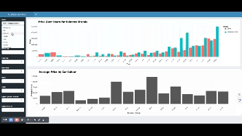

# Dashboard of Car Price in Australia


[](https://www.repostatus.org/#active) [](https://rstudio.com/) [](https://opensource.org/licenses/MIT)

## 💡Motivation

### Target audience: Car buyers and Automotive industry analysts

Understanding pricing trends in the automotive market is crucial for making informed decisions for individual car buyers and automotive industry analysts.

This interactive dashboard provides automotive industry analysts and professionals with a powerful tool to explore and analyze car pricing data. Users can filter the data based on various factors such as brand, condition(New, Demo, or Used), transmission type, colors, and more, allowing them to gain insights into pricing trends across different segments of the market. By visualizing average prices over time and comparing prices across different exterior colors, users can identify patterns and make strategic decisions to optimize pricing strategies.

## ⭐️App description:



[Check Video Demo Here](img/dashboard_demo.mp4)

### 💻Installation instructions:

To install and run the app locally, follow these steps:

1.  Clone or download the repository to your local machine.

``` bash
git clone https://github.com/sifanzzz/Car_price_prediction.git
```

2.  **Navigate to the directory**: Open your terminal or command prompt and navigate to the directory where your Shiny app files are located.

3.  **Create the virtual environment**

``` bash
conda env create -f environment.yml
conda activate car_price
```

4.  **Run the Shiny app**

``` bash
Rscript -e "shiny::runApp('./src/app.R', port = 8888)"
```

5.  **Access the dashboard**: Once the app is running, open a web browser and copy the link[**`http://127.0.0.1:8888`**](http://localhost:8888) to the browser. This will allow you to access and interact with the dashboard.

6.  **Interact with the dashboard**: You can now interact with the dashboard just as you would if you were running it from within RStudio. Explore the data, filter it based on your criteria, and visualize insights.

7.  **Close the app**: To stop the Shiny app, you can press **`Ctrl + C`** in the terminal where it's running. This will terminate the R script command and stop hosting the app.

## 📚 License

The Job Postings dashboard is licensed under the terms of the [MIT license](https://github.ubc.ca/MDS-2023-24/532_individual_sifan/blob/main/LICENSE)

## 🤜 Support

If you encounter any issues, require assistance, need to report a bug or request a feature, please file an issue through our [GitHub Issues](https://github.ubc.ca/MDS-2023-24/532_individual_sifan/issues).

## ✏️ Reference

Data resource: [Australian Vehicle Prices](https://www.kaggle.com/datasets/nelgiriyewithana/australian-vehicle-prices)
